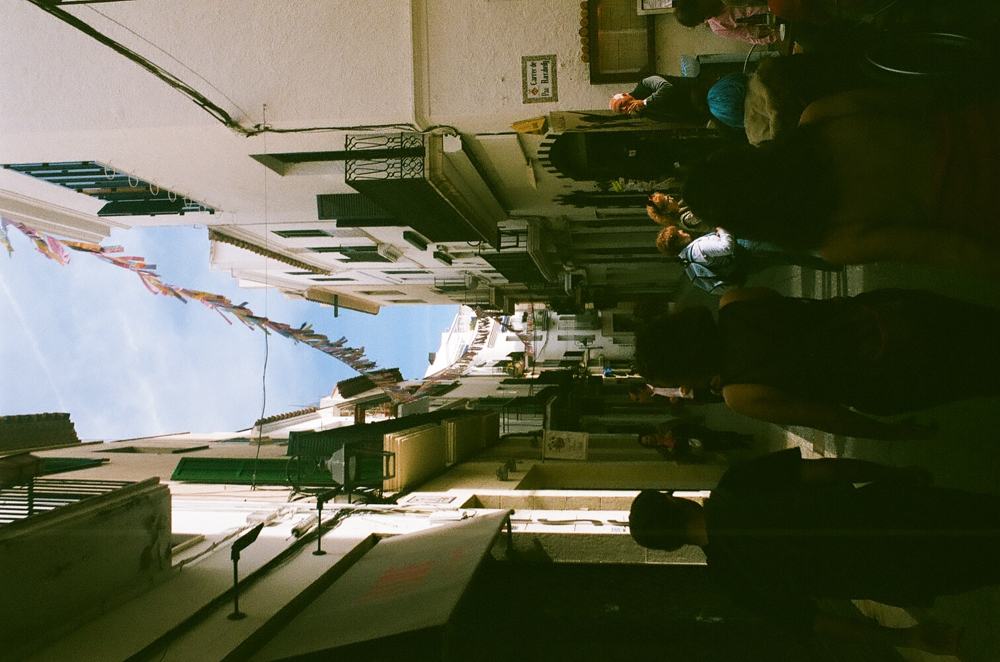
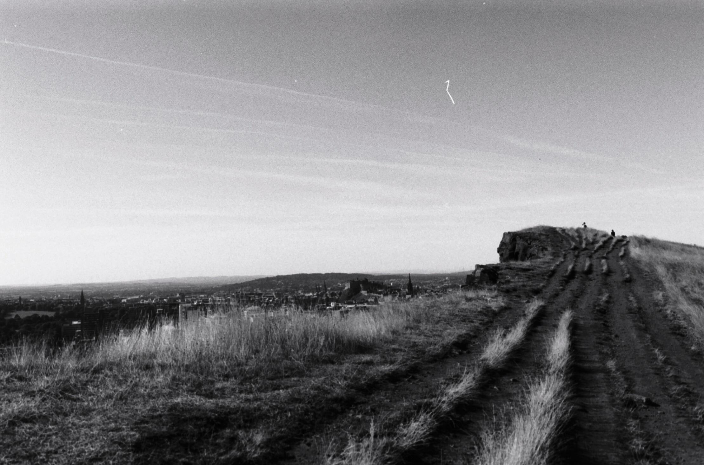

```{css, echo = FALSE}
*
body{
  font-family: "Courier New";
  font-size: small;
}
```

<br/>

<style>
.column-left{
  float: left;
  width: 50%;
  text-align: left;
}
.column-right{
  float: right;
  width: 50%;
  text-align: right;
}
</style>

<div class="column-left">





</div>

<div class="column-right">



</div>


